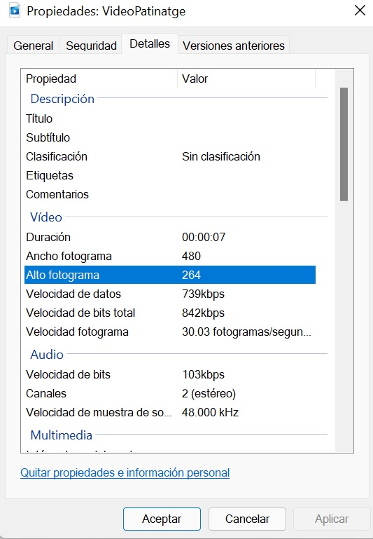
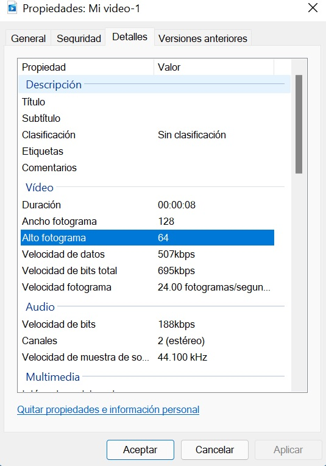
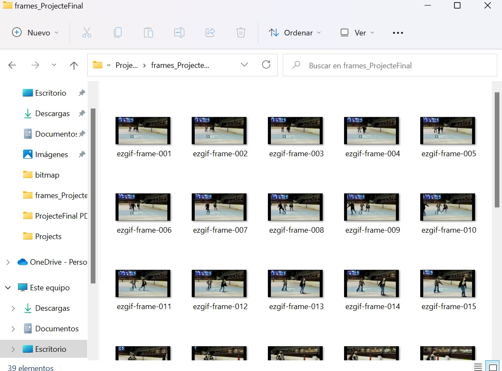

# **Projecte final: Reproductor de video amb display OLED**
El projecte consisteix en la reproducció d'un vídeo en el dispositiu OLED display mitjançant l'ESP32. 

## **1. Connexions**
Per al funcionament del projecte les connexions a realitzar del display al microcontrolador són les següents:

    GND --> GND  
    VCC --> 3V3  
    SCL --> GPIO 22  
    SDA --> GPIO 21  

Per una banda, tenim el GND del display connectat al GND de la esp32 i el VCC del display al 3V3 de la ESP32. Per altra banda, els cables SCL i SDA que son el de la senyal de rellotge i l'enviament de dades respectivament aniran connectats al GPIO 22 i GPIO 21 del microcontroladors, ja que són els pins que hi corresponen al I2C.

## **2. Passos previs al codi**
Primerament per tal de poder passar el vídeo pel display he convertit el vídeo a les mesures corresponents de la pantalla que son 128x64. També he canviat els fps (frames per segon) a 5 fps per tal que resulti més senzill passar tots el frames a bitmaps pel codi i perque el display accepti la imatge.  
  

  

Amb un convertidor online es parteix el vídeo en frames, i es descarrega en una carpeta zip de totes les imatges que componen el vídeo.

Finalment, amb un altre convertidor online es passa cada imatge al seu corresponent bitmap que serà el que indiqui a cada LED amb hexadecimal que haurà de fer.

## **3. Codi**

El codi sencer del projecte l'he penjat directament a github, ja que és molt llarg.

Els Bitmaps:
```c++
const unsigned char bitmap_frame1 [] PROGMEM = {
  0x00, 0x00, 0x00, 0x00, 0x00, 0x00, 0x00, 0x00, 0x00, 0x00, 0x00, 0x00, 0x00, 0x00, 0x00, 0x00, 
  0x00, 0x74, 0x00, 0x80, 0x00, 0x00, 0x00, 0x00, 0x00, 0x00, 0x00, 0x00, 0x00, 0x00, 0x00, 0x00, 
  0x00, 0xf8, 0x00, 0x7f, 0x40, 0x00, 0x00, 0x00, 0x00, 0x00, 0x00, 0x00, 0x00, 0x00, 0x00, 0x00, 
  0x01, 0x5e, 0x5c, 0xfd, 0x47, 0x80, 0x00, 0x00, 0x00, 0x00, 0x00, 0x00, 0x00, 0x00, 0x00, 0x00, 
  0x00, 0x7e, 0x6a, 0xfd, 0x26, 0x80, 0x00, 0x00, 0x00, 0x00, 0x00, 0x00, 0x00, 0x00, 0x00, 0x00, 
  0x01, 0x8c, 0x20, 0x2e, 0xe6, 0x00, 0x00, 0x00, 0x00, 0x00, 0x00, 0x00, 0x00, 0x00, 0x00, 0x00, 
  0x00, 0x8a, 0x0a, 0x0f, 0x67, 0xc0, 0x00, 0x00, 0x00, 0x00, 0x00, 0x00, 0x00, 0x00, 0x00, 0x00, 
  0x00, 0x04, 0x14, 0x50, 0xa7, 0x80, 0x00, 0x00, 0x00, 0x00, 0x00, 0x00, 0x00, 0x00, 0x01, 0x00, 
  0x01, 0x0e, 0x0f, 0x2a, 0x40, 0xc0, 0x00, 0x00, 0x00, 0x00, 0x00, 0x00, 0x00, 0x00, 0x00, 0x00, 
  0x00, 0x1e, 0x1e, 0x1f, 0xe6, 0x00, 0x00, 0x00, 0x00, 0x00, 0x00, 0x00, 0x00, 0x04, 0x02, 0x80, 
  0x00, 0x00, 0x2e, 0xaf, 0x66, 0x00, 0x00, 0x00, 0x00, 0x00, 0x01, 0x00, 0x02, 0x00, 0x05, 0x80, 
  0x00, 0x00, 0x00, 0x10, 0x85, 0x00, 0x00, 0x00, 0x00, 0x00, 0x00, 0x00, 0x00, 0x02, 0x0a, 0x00, 
  0x00, 0x00, 0x00, 0x02, 0x20, 0x00, 0x00, 0x00, 0x00, 0x00, 0x00, 0x00, 0x00, 0x08, 0x01, 0x00, 
  0x00, 0x00, 0x00, 0x00, 0x00, 0x00, 0x00, 0x00, 0x00, 0x00, 0x00, 0x00, 0x00, 0x00, 0x02, 0x00, 
  0x00, 0x00, 0x00, 0x00, 0x00, 0x00, 0x00, 0x00, 0x00, 0x00, 0x00, 0x00, 0x00, 0x00, 0x08, 0x80, 
  0x00, 0x00, 0x00, 0x00, 0x00, 0x00, 0x00, 0x00, 0x00, 0x00, 0x00, 0x00, 0x00, 0x00, 0x02, 0x80, 
  0x00, 0x00, 0x00, 0x00, 0x00, 0x00, 0x03, 0x80, 0x00, 0x00, 0x00, 0x00, 0x00, 0x00, 0x14, 0x00, 
  0x00, 0x00, 0x00, 0x00, 0x00, 0x00, 0x00, 0x44, 0x00, 0x00, 0x00, 0x00, 0x00, 0x00, 0x00, 0x00, 
  0x00, 0xa8, 0x00, 0x00, 0x00, 0x00, 0x01, 0x68, 0x00, 0x00, 0x00, 0x00, 0x00, 0x00, 0x00, 0x00, 
  0x00, 0x00, 0x00, 0x00, 0x00, 0x00, 0x00, 0xa9, 0x00, 0x00, 0x20, 0x00, 0x00, 0x00, 0x00, 0x00, 
  0x00, 0x00, 0x00, 0x00, 0x00, 0x00, 0x00, 0x40, 0x00, 0x00, 0x00, 0x00, 0x00, 0x00, 0x00, 0x00, 
  0x00, 0x00, 0x00, 0x00, 0x00, 0x00, 0x02, 0x00, 0x00, 0x00, 0x00, 0x00, 0x00, 0x00, 0x00, 0x00, 
  0x01, 0x55, 0x40, 0x00, 0x20, 0x04, 0x01, 0x00, 0x00, 0x00, 0x00, 0x00, 0x00, 0x00, 0x00, 0x00, 
  0x01, 0xff, 0xff, 0xff, 0x4f, 0xe2, 0x8e, 0xaa, 0xc0, 0x00, 0x00, 0x00, 0x00, 0x00, 0x00, 0x00, 
  0x01, 0xff, 0xff, 0xff, 0x27, 0xe4, 0x07, 0xff, 0xf0, 0x00, 0x00, 0x00, 0x00, 0x00, 0x00, 0x00, 
  0x01, 0x5f, 0xff, 0xff, 0x07, 0xe4, 0x07, 0xff, 0xff, 0xff, 0xd0, 0x00, 0x00, 0x00, 0x00, 0x00, 
  0x01, 0xeb, 0xff, 0xfe, 0x8b, 0xc0, 0x07, 0xff, 0xff, 0xff, 0xf7, 0xff, 0xf5, 0x00, 0x00, 0x00, 
  0x01, 0xff, 0xff, 0xff, 0x0f, 0xc0, 0x0f, 0xff, 0xff, 0xff, 0xf7, 0xff, 0xff, 0xff, 0xfd, 0x00, 
  0x01, 0xff, 0xff, 0xff, 0x5f, 0xc1, 0x07, 0xff, 0xff, 0xff, 0xf7, 0xff, 0xff, 0xff, 0xff, 0x80, 
  0x01, 0xff, 0xff, 0xff, 0x5f, 0xeb, 0x07, 0xff, 0xff, 0xff, 0xf7, 0xff, 0xff, 0xff, 0xff, 0x80, 
  0x01, 0xff, 0xff, 0xff, 0x5f, 0xdb, 0x87, 0xff, 0xeb, 0xff, 0xf7, 0xff, 0xff, 0xff, 0xff, 0x80, 
  0x01, 0xff, 0xff, 0xfe, 0x6f, 0xbb, 0xb7, 0xff, 0xfe, 0xbf, 0xeb, 0xff, 0xff, 0xff, 0xff, 0x80, 
  0x01, 0xff, 0xff, 0xfe, 0xef, 0xff, 0x93, 0xff, 0xff, 0xff, 0xf7, 0xff, 0xff, 0xff, 0xff, 0x80, 
  0x01, 0xff, 0xff, 0xfe, 0xef, 0x7b, 0xdb, 0xff, 0xff, 0xff, 0x57, 0xff, 0xff, 0xff, 0xff, 0x80, 
  0x01, 0xff, 0xff, 0xff, 0xff, 0xff, 0xdd, 0xff, 0xff, 0xff, 0xea, 0xff, 0xff, 0xff, 0xff, 0x80, 
  0x01, 0xff, 0xff, 0xff, 0xff, 0xff, 0xdf, 0xff, 0xff, 0xff, 0x7f, 0xaf, 0xff, 0xff, 0xff, 0x80, 
  0x01, 0xff, 0xff, 0xff, 0xff, 0xff, 0xff, 0xff, 0xff, 0xff, 0xff, 0xfa, 0xaf, 0xff, 0xff, 0x80, 
  0x01, 0xff, 0xff, 0xff, 0xff, 0xff, 0xff, 0xff, 0xff, 0xff, 0xff, 0xff, 0xf5, 0xff, 0xff, 0x80, 
  0x01, 0xff, 0xff, 0xff, 0xff, 0xff, 0xff, 0xff, 0xff, 0xff, 0xff, 0xff, 0xaf, 0x7f, 0xff, 0x80, 
  0x01, 0xff, 0xff, 0xff, 0xff, 0xff, 0xff, 0xff, 0xff, 0xff, 0xff, 0xff, 0xfa, 0xdf, 0xff, 0x80, 
  0x01, 0xff, 0xff, 0xff, 0xff, 0xff, 0xff, 0xff, 0xff, 0xff, 0xff, 0xff, 0xff, 0xfa, 0xff, 0x80, 
  0x01, 0xff, 0xff, 0xff, 0xff, 0xff, 0xff, 0xff, 0xff, 0xff, 0xff, 0xff, 0xff, 0xff, 0xbf, 0x80, 
  0x01, 0xff, 0xff, 0xff, 0xf7, 0xff, 0xff, 0xff, 0xff, 0xff, 0xff, 0xff, 0xff, 0xff, 0xff, 0x80, 
  0x01, 0xff, 0xff, 0xff, 0xee, 0xbf, 0xff, 0xff, 0xff, 0xff, 0xff, 0xff, 0xff, 0xff, 0xff, 0x80, 
  0x01, 0xff, 0xff, 0xff, 0xff, 0x7f, 0xff, 0xff, 0xff, 0xff, 0xff, 0xff, 0xff, 0xff, 0xff, 0x80, 
  0x01, 0xff, 0xff, 0xff, 0xef, 0xbf, 0xff, 0xff, 0xff, 0xff, 0xff, 0xff, 0xff, 0xff, 0xff, 0x80, 
  0x01, 0xff, 0xff, 0xff, 0xff, 0x7f, 0xff, 0xff, 0xff, 0xff, 0xff, 0xff, 0xff, 0xff, 0xff, 0x80, 
  0x01, 0xff, 0xff, 0xff, 0xef, 0xbf, 0xff, 0xff, 0xff, 0xff, 0xff, 0xff, 0xff, 0xff, 0xff, 0x80, 
  0x01, 0xff, 0xff, 0xff, 0xfa, 0xff, 0xff, 0xff, 0xff, 0xff, 0xff, 0xff, 0xff, 0xff, 0xff, 0x80, 
  0x01, 0xff, 0xff, 0xff, 0xff, 0xff, 0xff, 0xff, 0xff, 0xff, 0xff, 0xff, 0xff, 0xff, 0xff, 0x80, 
  0x01, 0xff, 0xff, 0xff, 0xff, 0xff, 0xff, 0xff, 0xff, 0xff, 0xff, 0xff, 0xff, 0xff, 0xff, 0x80, 
  0x01, 0xff, 0xff, 0xff, 0xff, 0xff, 0xff, 0xff, 0xff, 0xff, 0xff, 0xff, 0xff, 0xff, 0xff, 0x80, 
  0x01, 0xff, 0xff, 0xff, 0xff, 0xff, 0xff, 0xff, 0xff, 0xff, 0xff, 0xff, 0xff, 0xff, 0xff, 0x80, 
  0x01, 0xff, 0xff, 0xff, 0xff, 0xff, 0xff, 0xff, 0xff, 0xff, 0xff, 0xff, 0xff, 0xff, 0xff, 0x80, 
  0x01, 0xff, 0xff, 0xff, 0xff, 0xff, 0xff, 0xff, 0xff, 0xff, 0xff, 0xff, 0xff, 0xff, 0xff, 0x80, 
  0x01, 0xff, 0xff, 0xff, 0xff, 0xff, 0xff, 0xff, 0xff, 0xff, 0xff, 0xff, 0xff, 0xff, 0xff, 0x80, 
  0x01, 0xff, 0xff, 0xff, 0xff, 0xff, 0xff, 0xff, 0xff, 0xff, 0xff, 0xff, 0xff, 0xff, 0xff, 0x80, 
  0x01, 0xff, 0xff, 0xff, 0xff, 0xff, 0xff, 0xff, 0xff, 0xff, 0xff, 0xff, 0xff, 0xff, 0xff, 0x80, 
  0x01, 0xff, 0xff, 0xff, 0xff, 0xff, 0xff, 0xff, 0xff, 0xff, 0xff, 0xff, 0xff, 0xff, 0xff, 0x80, 
  0x01, 0xff, 0xff, 0xff, 0xff, 0xff, 0xff, 0xff, 0xff, 0xff, 0xff, 0xff, 0xff, 0xff, 0xff, 0x80, 
  0x01, 0xff, 0xff, 0xff, 0xff, 0xff, 0xff, 0xff, 0xff, 0xff, 0xff, 0xff, 0xff, 0xff, 0xff, 0x80, 
  0x01, 0xff, 0xff, 0xff, 0xff, 0xff, 0xff, 0xff, 0xff, 0xff, 0xff, 0xff, 0xff, 0xff, 0xff, 0x80, 
  0x01, 0xff, 0xff, 0xff, 0xff, 0xff, 0xff, 0xff, 0xff, 0xff, 0xff, 0xff, 0xff, 0xff, 0xff, 0x80, 
  0x00, 0xaa, 0xaa, 0xaa, 0xaa, 0xaa, 0xaa, 0xaa, 0xaa, 0xaa, 0xaa, 0xaa, 0xaa, 0xaa, 0xaa, 0x80, 
};
```
Per altra banda, en el setup s'inicialitza el display en el 0x03 que és el que correspon. 
```c++
void setup() {
  display.begin(SSD1306_SWITCHCAPVCC, 0x3C); //or 0x3D
}
```
Finalment, en el void loop s'estableix la velocitat de cada frame al display, que en aquest cas en ser 5 fps s'estableix un delay de 200ms per tal que cada 5 frames es compleixi 1 segon.

```c++
display.clearDisplay(); //for Clearing the display
  display.drawBitmap(0, 0, bitmap_frame1, 128, 64,WHITE, BLACK);
  display.display();
  delay(200);
  display.clearDisplay(); //for Clearing the display
  display.drawBitmap(0, 0, bitmap_frame2, 128, 64,WHITE, BLACK);
  display.display();
  delay(200)
;
```
### **4. Video**

https://drive.google.com/file/d/1JyOxp37tQh-4gL_0Y-itenanPivNLcOo/view?usp=sharing
